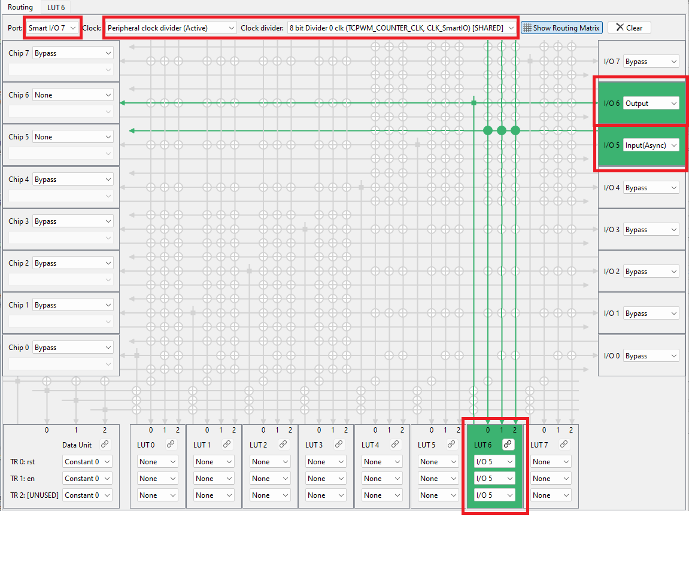

# PDL: TCPWM counter using Smart I/O

This code example uses the signal to user LED1, which switches depending on the level of the CC0 match interrupt of the TCPWM counter initiated by the PWM signal on the TRAVEO&trade; T2G MCU, as the input port of Smart I/O, and confirm that the output of Smart I/O is reflected to user LED2.

[View this README on GitHub.](https://github.com/Infineon/mtb-example-ce240927-tcpwm-counter-smartio)

[Provide feedback on this code example.](https://yourvoice.infineon.com/jfe/form/SV_1NTns53sK2yiljn?Q_EED=eyJVbmlxdWUgRG9jIElkIjoiQ0UyNDA3NzYiLCJTcGVjIE51bWJlciI6IjAwMi00MDc3NiIsIkRvYyBUaXRsZSI6IlBETDogVENQV00gY291bnRlciB1c2luZyBTbWFydCBJL08iLCJyaWQiOiJnby5zaGltYWRhQGluZmluZW9uLmNvbSIsIkRvYyB2ZXJzaW9uIjoiMS4xLjAiLCJEb2MgTGFuZ3VhZ2UiOiJFbmdsaXNoIiwiRG9jIERpdmlzaW9uIjoiTUNEIiwiRG9jIEJVIjoiQVVUTyIsIkRvYyBGYW1pbHkiOiJBVVRPIE1DVSJ9)


## Requirements

- [ModusToolbox&trade;](https://www.infineon.com/modustoolbox) v3.6 or later (tested with v3.6)
- Board support package (BSP) minimum required version 3.0.0
- Programming language: C
- Associated parts: [TRAVEO&trade; T2G family Cluster series](https://www.infineon.com/cms/en/product/microcontroller/32-bit-traveo-t2g-arm-cortex-microcontroller/32-bit-traveo-t2g-arm-cortex-for-cluster/), [TRAVEO&trade; T2G family body high CYT4BF series](https://www.infineon.com/products/microcontroller/32-bit-traveo-t2g-arm-cortex/for-body/t2g-cyt4bf)


## Supported toolchains (make variable 'TOOLCHAIN')

- GNU Arm&reg; Embedded Compiler v14.2.1 (`GCC_ARM`) – Default value of `TOOLCHAIN`
- Arm&reg; Compiler v6.22 (`ARM`)
- IAR C/C++ Compiler v9.50.2 (`IAR`)


## Supported kits (make variable 'TARGET')


- [TRAVEO&trade; T2G Cluster 6M Lite Kit](https://www.infineon.com/cms/en/product/evaluation-boards/kit_t2g_c-2d-6m_lite/) (`KIT_T2G_C-2D-6M_LITE`) – Default value of `TARGET`<br>
- [TRAVEO&trade; T2G Cluster 4M Lite Kit](https://www.infineon.com/evaluation-board/KIT-T2G-C-2D-4M-LITE) (`KIT_T2G_C-2D-4M_LITE`)<br>
- [TRAVEO&trade; T2G Body high Lite Kit](https://www.infineon.com/evaluation-board/KIT-T2G-B-H-LITE) (`KIT_T2G-B-H_LITE`)<br>
- [TRAVEO&trade; T2G Body high Evaluation Kit](https://www.infineon.com/evaluation-board/KIT-T2G-B-H-EVK) (`KIT_T2G-B-H_EVK`)


## Hardware setup

This example needs to connect pins to LED1 and LED2 with jumper wires. **Table 1** shows connection jumper pin.

**Table 1. Connection jumper pin**

 Board                     |  Jumper setting                  | Waveform observation pin           | Confiramtion
 :-------                  | :-----------------------------   | :------------  | :------------  
 KIT_T2G_C-2D-6M_LITE      | -                                | -              | USER_LED1, USER_LED2  
 KIT_T2G_C-2D-4M_LITE      | -                                | P9[5], P9[6]   | Osilloscope  
 KIT_T2G-B-H_LITE          | P13.5 - P5.0, P13.6 - P5.1       | -              | USER_LED1, USER_LED2           
 KIT_T2G-B-H_EVK           | P13.5 - P16.1, P13.6 - P16.2     | -              | USER_LED1, USER_LED2  

## Software setup

See the [ModusToolbox&trade; tools package installation guide](https://www.infineon.com/ModusToolboxInstallguide) for information about installing and configuring the tools package.

This example requires no additional software or tools.


## Using the code example


### Create the project

The ModusToolbox&trade; tools package provides the Project Creator as both a GUI tool and a command line tool.

<details><summary><b>Use Project Creator GUI</b></summary>

1. Open the Project Creator GUI tool.

   There are several ways to do this, including launching it from the dashboard or from inside the Eclipse IDE. For more details, see the [Project Creator user guide](https://www.infineon.com/ModusToolboxProjectCreator) (locally available at *{ModusToolbox&trade; install directory}/tools_{version}/project-creator/docs/project-creator.pdf*).

2. On the **Choose Board Support Package (BSP)** page, select a kit supported by this code example. See [Supported kits](#supported-kits-make-variable-target).

   > **Note:** To use this code example for a kit not listed here, you may need to update the source files. If the kit does not have the required resources, the application may not work.

3. On the **Select Application** page:

   a. Select the **Applications(s) Root Path** and the **Target IDE**.

   > **Note:** Depending on how you open the Project Creator tool, these fields may be pre-selected for you.

   b. Select this code example from the list by enabling its check box.

   > **Note:** You can narrow the list of displayed examples by typing in the filter box.

   c. (Optional) Change the suggested **New Application Name** and **New BSP Name**.

   d. Click **Create** to complete the application creation process.

</details>


<details><summary><b>Use Project Creator CLI</b></summary>

The 'project-creator-cli' tool can be used to create applications from a CLI terminal or from within batch files or shell scripts. This tool is available in the *{ModusToolbox&trade; install directory}/tools_{version}/project-creator/* directory.

Use a CLI terminal to invoke the 'project-creator-cli' tool. On Windows, use the command-line 'modus-shell' program provided in the ModusToolbox&trade; installation instead of a standard Windows command-line application. This shell provides access to all ModusToolbox&trade; tools. You can access it by typing "modus-shell" in the search box in the Windows menu. In Linux and macOS, you can use any terminal application.

The following example clones the "[mtb-example-ce240927-tcpwm-counter-smartio](https://github.com/Infineon/mtb-example-ce240927-tcpwm-counter-smartio)" application with the desired name "TcpwmCounterSmartio" configured for the *KIT_T2G_C-2D-6M_LITE* BSP into the specified working directory, *C:/mtb_projects*:

   ```
   project-creator-cli --board-id KIT_T2G_C-2D-6M_LITE --app-id mtb-example-ce240927-tcpwm-counter-smartio --user-app-name TcpwmCounterSmartio --target-dir "C:/mtb_projects"
   ```

The 'project-creator-cli' tool has the following arguments:

Argument | Description | Required/optional
---------|-------------|-----------
`--board-id` | Defined in the <id> field of the [BSP](https://github.com/Infineon?q=bsp-manifest&type=&language=&sort=) manifest | Required
`--app-id`   | Defined in the <id> field of the [CE](https://github.com/Infineon?q=ce-manifest&type=&language=&sort=) manifest | Required
`--target-dir`| Specify the directory in which the application is to be created if you prefer not to use the default current working directory | Optional
`--user-app-name`| Specify the name of the application if you prefer to have a name other than the example's default name | Optional

> **Note:** The project-creator-cli tool uses the `git clone` and `make getlibs` commands to fetch the repository and import the required libraries. For details, see the "Project creator tools" section of the [ModusToolbox&trade; tools package user guide](https://www.infineon.com/ModusToolboxUserGuide) (locally available at {ModusToolbox&trade; install directory}/docs_{version}/mtb_user_guide.pdf).

</details>


### Open the project

After the project has been created, you can open it in your preferred development environment.


<details><summary><b>Eclipse IDE</b></summary>

If you opened the Project Creator tool from the included Eclipse IDE, the project will open in Eclipse automatically.

For more details, see the [Eclipse IDE for ModusToolbox&trade; user guide](https://www.infineon.com/MTBEclipseIDEUserGuide) (locally available at *{ModusToolbox&trade; install directory}/docs_{version}/mt_ide_user_guide.pdf*).

</details>


<details><summary><b>Visual Studio (VS) Code</b></summary>

Launch VS Code manually, and then open the generated *{project-name}.code-workspace* file located in the project directory.

For more details, see the [Visual Studio Code for ModusToolbox&trade; user guide](https://www.infineon.com/MTBVSCodeUserGuide) (locally available at *{ModusToolbox&trade; install directory}/docs_{version}/mt_vscode_user_guide.pdf*).

</details>


<details><summary><b>Keil µVision</b></summary>

Double-click the generated *{project-name}.cprj* file to launch the Keil µVision IDE.

For more details, see the [Keil µVision for ModusToolbox&trade; user guide](https://www.infineon.com/MTBuVisionUserGuide) (locally available at *{ModusToolbox&trade; install directory}/docs_{version}/mt_uvision_user_guide.pdf*).

</details>


<details><summary><b>IAR Embedded Workbench</b></summary>

Open IAR Embedded Workbench manually, and create a new project. Then select the generated *{project-name}.ipcf* file located in the project directory.

For more details, see the [IAR Embedded Workbench for ModusToolbox&trade; user guide](https://www.infineon.com/MTBIARUserGuide) (locally available at *{ModusToolbox&trade; install directory}/docs_{version}/mt_iar_user_guide.pdf*).

</details>


<details><summary><b>Command line</b></summary>

If you prefer to use the CLI, open the appropriate terminal, and navigate to the project directory. On Windows, use the command-line 'modus-shell' program; on Linux and macOS, you can use any terminal application. From there, you can run various `make` commands.

For more details, see the [ModusToolbox&trade; tools package user guide](https://www.infineon.com/ModusToolboxUserGuide) (locally available at *{ModusToolbox&trade; install directory}/docs_{version}/mtb_user_guide.pdf*).

</details>


## Operation


1. Connect the board to your PC using the provided USB cable through the KitProg3 USB connector.

2. Program the board using one of the following:

   <details><summary><b>Using Eclipse IDE</b></summary>

      1. Select the application project in the Project Explorer.

      2. In the **Quick Panel**, scroll down, and click **\<Application Name> Program (KitProg3_MiniProg4)**.
   </details>


   <details><summary><b>In other IDEs</b></summary>

   Follow the instructions in your preferred IDE.
   </details>


   <details><summary><b>Using CLI</b></summary>

     From the terminal, execute the `make program` command to build and program the application using the default toolchain to the default target. The default toolchain is specified in the application's Makefile but you can override this value manually:
      ```
      make program TOOLCHAIN=<toolchain>
      ```

      Example:
      ```
      make program TOOLCHAIN=GCC_ARM
      ```
   </details>

3. After successful programming, observe that the USER_LED1 and USER_LED2 blink alternately or waveform on osilloscope. 

   **Note:** for Cluster 2D 4M. KIT_T2G_C-2D_LITE can only observe by waveform, not LEDs. The waveform is Figure.1
   
    **Figure 1.  The wafeform on osilloscope**

   
   

## Debugging

You can debug the example to step through the code.


<details><summary><b>In Eclipse IDE</b></summary>

Use the **\<Application Name> Debug (KitProg3_MiniProg4)** configuration in the **Quick Panel**. For details, see the "Program and debug" section in the [Eclipse IDE for ModusToolbox&trade; user guide](https://www.infineon.com/MTBEclipseIDEUserGuide).


</details>


<details><summary><b>In other IDEs</b></summary>

Follow the instructions in your preferred IDE.

</details>


## Design and implementation

### Resources and settings

This design consists that the PWM periodically triggers the TCPWM counter. When the TCPWM counter reaches a certain value, it inverts the counter value. it is input to the smart I/O. And it generates USER_LED1 and USER_LED2. USER_LED2 is invert of USER_LED1.

**Figure 2** shows the Smart I/O connection from TCPWM output to the Smart I/O output port.
The connection is implemented using the LUTs of the Smart I/O resource.

**Figure 2. Smart I/O connection diagram**


 **Table 2** shows each resource.

**Table 2. Application resources**

 Resource                      |  Alias/object          |    Purpose
 :-------                      | :------------          | :------------
 PWM (PDL)                     | TCPWM PWM              | PWM output line signal to start counter
 COUNTER (PDL)                 | TCPWM Counter          | Counter work at 200 kHz clock frequency
 TCPWM counter value input pin | SMART_IO_INPUT_PIN     | Change the input logic level
 Smart I/O                     | SMART_IO               | Implements TCPWM counter signal value connection logic
 Smart I/O output pin            | SMART_IO_OUTPUT_PIN    | Display output state using the USER_LED1 and USER_LED2

<br>
The following shows the configuration for each.

<br>

**Figure 3** shows PWM setting.
The PWM works with 10 MHz and 9999 period value. It output the trigger 0 signal to start TCPWM counter.

**Figure 3. PWM setting**


	

**Figure 4** shows TCPWM counter setting.
 The TCPWM counter works with 200 kHz and 60000 period value. Enable the CC0 compare function and enable the CC0 match interrupt. It will generate an interrupt to toggle the TCPWM counter value when counter up to CC0 match value 50000. 

**Figure 4. Counter setting**


The TCPWM counter value is input to smart IO, which output to Smart I/O output pin.
**Figure 5** shows enableing smart I/O and pin settings. This sets up the enableing smart I/O and the pin to be used in smart I/O.

**Figure 5. Enabling Smart I/O**


**Figure 6** shows routing configurations. This sets up the routing connections for smart I/O. I/O6 and I/O5 are output. Chip5 is the TCPWM counter value. LUT5 and LUT6 is logic. And make the clock active.

**Figure 6. Smart I/O routing configuration**




**Figure 7** shows LUT5 configurations. And **Figure 8** shows LUT6 configurations. This sets up the logic for smart I/O.

**Figure 7. Smart I/O LUT5 configuration**


**Figure 8. Smart I/O LUT6 configuration**


**Figure 9** shows the peripheral clock configuration for Smart I/O resources. The clock is 200KHz.

**Figure 9. Peripheral clock configuration for Smart I/O**


## Related resources

Resources  | Links
-----------|----------------------------------
Application notes  | [AN235305](https://www.infineon.com/assets/row/public/documents/10/42/infineon-an235305-getting-started-with-traveo-t2g-family-mcus-in-modustoolbox-applicationnotes-en.pdf) – Getting started with TRAVEO&trade; T2G family MCUs in ModusToolbox&trade; <br> [AN220193](https://www.infineon.com/assets/row/public/documents/10/42/infineon-an220118---gpio-usage-setup-in-traveo-t2g-family-applicationnotes-en.pdf) – GPIO usage setup in TRAVEO&trade; T2G family <br> [AN220224](https://www.infineon.com/assets/row/public/documents/10/42/infineon-an220224---how-to-use-timer-counter-and-pwm-tcpwm-in-traveo-t2g-family-applicationnotes-en.pdf) – How to use Timer, Counter, and PWM (TCPWM) in TRAVEO&trade; T2G family <br> [AN220203](https://www.infineon.com/assets/row/public/documents/10/42/infineon-an220203---smart-i-o-usage-setup-in-traveo-t2g-family-applicationnotes-en.pdf) – Smart I/O usage setup in TRAVEO&trade; T2G family
Code examples  | [Using ModusToolbox&trade;](https://github.com/Infineon/Code-Examples-for-ModusToolbox-Software) on GitHub
Device documentation | [TRAVEO&trade; T2G body high family MCUs datasheets](https://www.infineon.com/products/microcontroller/32-bit-traveo-t2g-arm-cortex/for-body/t2g-cyt4bf/#documents) <br> [TRAVEO&trade; T2G body high family MCUs architecture/registers reference manuals](https://www.infineon.com/products/microcontroller/32-bit-traveo-t2g-arm-cortex/for-body/t2g-cyt4bf/#documents) <br> [TRAVEO&trade; T2G cluster family MCUs datasheets for CYT4DN](https://www.infineon.com/products/microcontroller/32-bit-traveo-t2g-arm-cortex/for-cluster/#documents) <br> [TRAVEO&trade; T2G cluster family MCUs architecture/registers reference manuals for CYT4DN](https://www.infineon.com/products/microcontroller/32-bit-traveo-t2g-arm-cortex/for-cluster/#documents) <br> [TRAVEO&trade; T2G cluster family MCUs datasheets for CYT3DL](https://www.infineon.com/products/microcontroller/32-bit-traveo-t2g-arm-cortex/for-cluster/#documents) <br> [TRAVEO&trade; T2G cluster family MCUs architecture/registers reference manuals for CYT3DL](https://www.infineon.com/products/microcontroller/32-bit-traveo-t2g-arm-cortex/for-cluster/#documents)　<br>  
Development kits | Select your kits from the [Evaluation board finder](https://www.infineon.com/cms/en/design-support/finder-selection-tools/product-finder/evaluation-board).
Libraries on GitHub  | [mtb-pdl-cat1](https://github.com/Infineon/mtb-pdl-cat1) – Peripheral Driver Library (PDL) 　<br> [retarget-io](https://github.com/Infineon/retarget-io) – Utility library to retarget STDIO messages to a UART port　
Tools  | [ModusToolbox&trade;](https://www.infineon.com/modustoolbox) – ModusToolbox&trade; software is a collection of easy-to-use libraries and tools enabling rapid development with Infineon MCUs for applications ranging from wireless and cloud-connected systems, edge AI/ML, embedded sense and control, to wired USB connectivity using PSOC&trade; Industrial/IoT MCUs, AIROC&trade; Wi-Fi and Bluetooth&reg; connectivity devices, XMC&trade; Industrial MCUs, and EZ-USB&trade;/EZ-PD&trade; wired connectivity controllers. ModusToolbox&trade; incorporates a comprehensive set of BSPs, HAL, libraries, configuration tools, and provides support for industry-standard IDEs to fast-track your embedded application development.

<br>


## Other resources

Infineon provides a wealth of data at [www.infineon.com](https://www.infineon.com) to help you select the right device, and quickly and effectively integrate it into your design.


## Document history

Document title: *CE240776* – *PDL: TCPWM counter using Smart I/O* 

| Version | Description of change
| ------- | ---------------------
| 1.0.0   | New code example
| 1.1.0   | Added support for KIT_T2G_C-2D-4M_LITE, KIT_T2G-B-H_EVK and KIT_T2G-B-H_LITE, and updated to support ModusToolbox&trade; v3.6. |
<br>


All referenced product or service names and trademarks are the property of their respective owners.

The Bluetooth&reg; word mark and logos are registered trademarks owned by Bluetooth SIG, Inc., and any use of such marks by Infineon is under license.

PSOC&trade;, formerly known as PSoC&trade;, is a trademark of Infineon Technologies. Any references to PSoC&trade; in this document or others shall be deemed to refer to PSOC&trade;.

---------------------------------------------------------

(c) 2024-2026, Infineon Technologies AG, or an affiliate of Infineon Technologies AG. All rights reserved.
This software, associated documentation and materials ("Software") is owned by Infineon Technologies AG or one of its affiliates ("Infineon") and is protected by and subject to worldwide patent protection, worldwide copyright laws, and international treaty provisions. Therefore, you may use this Software only as provided in the license agreement accompanying the software package from which you obtained this Software. If no license agreement applies, then any use, reproduction, modification, translation, or compilation of this Software is prohibited without the express written permission of Infineon.
<br>
Disclaimer: UNLESS OTHERWISE EXPRESSLY AGREED WITH INFINEON, THIS SOFTWARE IS PROVIDED AS-IS, WITH NO WARRANTY OF ANY KIND, EXPRESS OR IMPLIED, INCLUDING, BUT NOT LIMITED TO, ALL WARRANTIES OF NON-INFRINGEMENT OF THIRD-PARTY RIGHTS AND IMPLIED WARRANTIES SUCH AS WARRANTIES OF FITNESS FOR A SPECIFIC USE/PURPOSE OR MERCHANTABILITY. Infineon reserves the right to make changes to the Software without notice. You are responsible for properly designing, programming, and testing the functionality and safety of your intended application of the Software, as well as complying with any legal requirements related to its use. Infineon does not guarantee that the Software will be free from intrusion, data theft or loss, or other breaches (“Security Breaches”), and Infineon shall have no liability arising out of any Security Breaches. Unless otherwise explicitly approved by Infineon, the Software may not be used in any application where a failure of the Product or any consequences of the use thereof can reasonably be expected to result in personal injury.